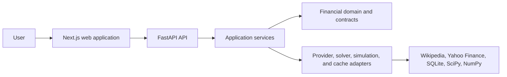

# Portfolio DSS

Portfolio DSS is an educational decision support system for understanding and comparing stock
portfolios. It exposes the trade-off between estimated return, risk, and uncertainty for a current
portfolio or a guided portfolio built from capital and risk preferences.

The system does not execute trades, promise future performance, or provide a regulated suitability
assessment. Every recommendation includes its assumptions, model provenance, and deterministic
explanations.

## Phase B capabilities

- Value and analyze ticker-and-quantity portfolios over an explicit historical window.
- Compare the current portfolio with equal weight and an S&P 500 benchmark represented by SPY.
- Generate a long-only mean-variance efficient frontier with optional concentration limits.
- Explore conservative, moderate, and aggressive alternatives without exposing mathematical tuning
  as the primary user choice.
- Build a portfolio from USD capital and a short, deterministic preference questionnaire.
- Switch between historical arithmetic means and a simple exponentially weighted return estimate.
- Compare simulated outcome distributions with reproducible Monte Carlo seeds.
- Review concentration, contribution to risk, solver diagnostics, assumptions, and traceable
  recommendation explanations.
- Evaluate historical and forecast estimators with a frozen, walk-forward backtest.

## Architecture

The repository is a modular monorepo with one FastAPI application and one Next.js application.
Financial domain logic is independent of HTTP frameworks, persistence, and market-data libraries.
Providers, numerical solvers, and storage are replaceable adapters behind typed contracts.



See [Architecture](docs/ARCHITECTURE.md) for the system, dependency, and decision-flow diagrams.

## Prerequisites

- Python 3.12
- [uv](https://docs.astral.sh/uv/)
- Node.js 24 and npm

## Reproducible offline demo

The supported presentation path uses deterministic synthetic market data. It requires no provider
access, cache preparation, notebook execution, or manual data transformation. The UI labels the
fixture provenance so it cannot be mistaken for historical evidence.

In terminal 1:

```powershell
cd apps/api
uv sync --locked --all-groups
uv run uvicorn app.cli.demo:app --host 127.0.0.1 --port 8011
```

In terminal 2, using PowerShell:

```powershell
cd apps/web
npm ci
$env:API_BASE_URL="http://127.0.0.1:8011"
npm run dev
```

For a POSIX shell, replace the last two commands with:

```bash
API_BASE_URL=http://127.0.0.1:8011 npm run dev
```

Open `http://localhost:3000`. The status panel should report that the API is connected. Follow the
fixed five-minute path and troubleshooting guidance in the [demo runbook](docs/DEMO.md).

## Production data mode

Use the normal API composition to retrieve the current S&P 500 membership from Wikipedia and
adjusted daily prices from Yahoo Finance:

```powershell
cd apps/api
uv sync --locked --all-groups
uv run uvicorn app.main:app --reload
```

Then start the web app in a second terminal:

```powershell
cd apps/web
npm ci
npm run dev
```

The default API URL is `http://127.0.0.1:8000`. Copy `apps/web/.env.example` to
`apps/web/.env.local` only when a different URL is required. Production mode depends on external
provider availability and uses the local SQLite cache under `data/`.

## Reproducible historical evidence

The interactive offline demo and the historical evaluation serve different purposes:

- [Week 9 frozen backtest](examples/backtest/week9/README.md) compares six strategies over the
  same 1,759 daily evaluation returns from 2019-01-02 through 2025-12-31.
- [Week 11 case studies](examples/case-studies/week11/README.md) regenerate three decision-support
  examples from the same frozen price snapshot.
- Both report formats are self-contained HTML with adjacent full-precision JSON, configuration,
  provenance, assumptions, and stable content hashes.

The [methodology and results](docs/METHODOLOGY_AND_RESULTS.md) document explains what these results
do and do not support.

## Quality checks

Run backend checks from `apps/api`:

```powershell
uv sync --locked --all-groups
uv run ruff check .
uv run ruff format --check .
uv run mypy
uv run pytest
```

Run frontend checks from `apps/web`:

```powershell
npm ci
npm run lint
npm run typecheck
npm test
npm run build
```

GitHub Actions runs the same locked backend and frontend gates. The final Phase B baseline contains
227 backend tests and 42 frontend tests.

## Financial defaults

- Base currency: USD.
- Price field: daily adjusted close.
- Return convention: daily simple returns.
- Annualization: 252 trading periods.
- Missing data: no silent imputation; aligned observations use timestamp intersection.
- Benchmark: SPY adjusted prices, explicitly labelled as an S&P 500 total-return ETF proxy.
- Default simulation: one year, 10,000 paths, seed 42.

Market-data, cache, and frontier-profile settings are documented in [Data](docs/DATA.md) and exposed
in generated report assumptions. Invalid configuration fails explicitly.

## Documentation

- [Product and scope](docs/PRODUCT.md)
- [Architecture](docs/ARCHITECTURE.md)
- [Domain model](docs/DOMAIN_MODEL.md)
- [Methodology and results](docs/METHODOLOGY_AND_RESULTS.md)
- [Data and provenance](docs/DATA.md)
- [API contract](docs/API.md)
- [Testing and validation](docs/TESTING.md)
- [Demo runbook](docs/DEMO.md)
- [Italian presentation deck](docs/presentation/portfolio-dss-week12-it.pptx)
- [Italian presentation and demo script](docs/presentation/demo-script-it.md)
- [Limitations](docs/LIMITATIONS.md)
- [Future work](docs/FUTURE_WORK.md)
- [Roadmap](docs/ROADMAP.md)
- [Architecture decision records](docs/adr/)

Read [Limitations](docs/LIMITATIONS.md) before interpreting any recommendation, simulation, or
historical result.
