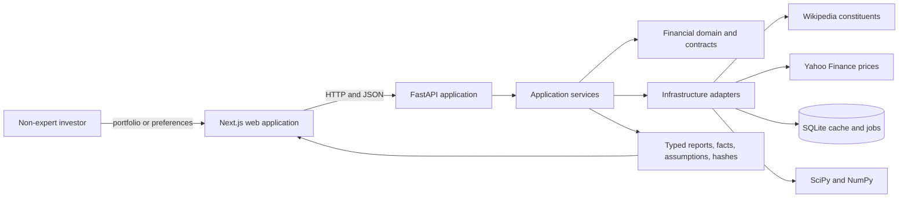
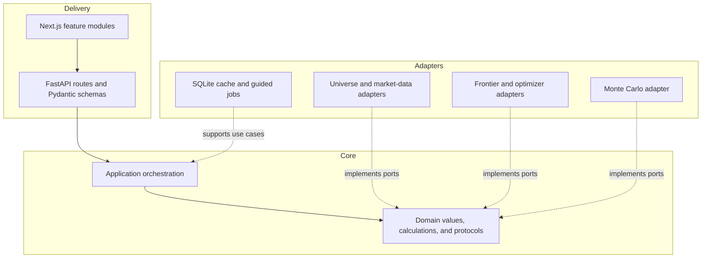
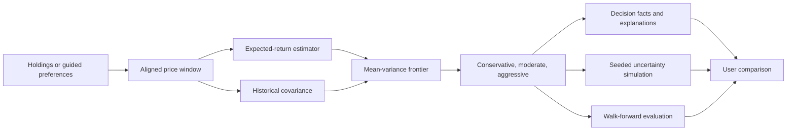

# Architecture

## Architectural style

Start with a **modular monorepo** using a clean/hexagonal architecture on the backend and a feature-oriented frontend.

Do not introduce microservices in Phase A/B.

The design goal is replaceability of data sources and analytical models, not distributed-system complexity.

## System context



The production composition uses external sources and a local cache. The supported presentation
composition replaces external providers with deterministic synthetic adapters while preserving the
same API, application, and domain boundaries.

## Dependency and adapter boundaries



Dependencies point inward. Domain and application code do not import FastAPI, Next.js, SQLite,
Wikipedia, Yahoo Finance, or provider-specific data structures.

## Decision flow



Observed history, estimated parameters, simulated outcomes, and out-of-sample results remain
explicitly distinguished throughout this flow.

## Repository layout

```text
portfolio-dss/
├── README.md
├── AGENTS.md
├── apps/
│   ├── api/                  # FastAPI backend
│   │   └── app/
│   │       ├── api/          # HTTP routes + request/response schemas
│   │       ├── application/  # use cases / orchestration
│   │       ├── domain/       # financial domain + contracts
│   │       ├── infrastructure/ # providers, persistence, concrete solvers
│   │       └── core/         # config, logging, shared runtime concerns
│   └── web/                  # Next.js + TypeScript frontend
│       └── src/
│           ├── app/
│           ├── features/
│           ├── components/
│           └── lib/
├── docs/
├── notebooks/                # experiments only
├── scripts/                  # data/dev/reproducibility scripts
├── tests/                    # cross-cutting/system tests
└── data/                     # local cache; large/generated data ignored by git
```

The exact subfolders can evolve, but dependency direction must remain stable.

### Week 1 package boundaries

- `app/domain` contains immutable financial objects, calculation conventions, errors, and provider protocols. It imports no framework or adapter packages.
- `app/application` will orchestrate domain behavior as use cases are introduced.
- `app/infrastructure` will implement market-universe, market-data, cache, and solver adapters.
- `app/api` owns FastAPI routes and Pydantic request/response schemas.
- `app/core` owns runtime metadata and configuration wiring, translating external settings into domain values when needed.

The web app uses Next.js App Router under `src/app`, feature-owned UI under `src/features`, and external communication helpers under `src/lib`.

Week 5 adds a separate `EfficientFrontierGenerator` domain protocol and a SciPy frontier adapter.
`PortfolioFrontierService` orchestrates one aligned stock-plus-SPY sample, model estimation,
frontier generation, reference metrics, typed decision facts, and report hashing. The API owns
Pydantic serialization of the immutable report values; the domain and application remain
framework-independent. The existing Week 4 optimizer contract and route remain available.

The `portfolio-frontier` web feature consumes the complete report through a Next.js proxy. Its
three-profile selection is local state, with no market-data request when switching profiles.

## Backend dependency rule

```text
API / Infrastructure
        ↓
Application
        ↓
Domain
```

`domain` must not import FastAPI, yfinance, pandas-specific provider code, database clients, or web concerns.

Numerical libraries may be used inside domain services where they are part of the mathematical implementation, but external I/O belongs in infrastructure.

## System flow

```text
                 ┌──────────────────────┐
                 │      Next.js UI      │
                 └──────────┬───────────┘
                            │ HTTP/JSON
                 ┌──────────▼───────────┐
                 │      FastAPI API     │
                 └──────────┬───────────┘
                            │
                 ┌──────────▼───────────┐
                 │ Application Use Cases│
                 └──────────┬───────────┘
                            │
      ┌─────────────────────┼─────────────────────┐
      │                     │                     │
┌─────▼─────┐       ┌───────▼────────┐     ┌──────▼──────┐
│ Data Ports │       │ Model Contracts│     │ DSS Services│
└─────┬─────┘       └───────┬────────┘     └──────┬──────┘
      │                     │                     │
┌─────▼────────┐   ┌────────▼─────────┐   ┌───────▼─────────┐
│ Market Data  │   │ Return / Risk /  │   │ Explanation /   │
│ Adapters     │   │ Optimizer / MC   │   │ Comparison      │
└──────────────┘   └──────────────────┘   └─────────────────┘
```

## Core contracts

The exact Python signatures may evolve, but these responsibilities should remain distinct.

### MarketUniverseProvider

```python
class MarketUniverseProvider(Protocol):
    def get_universe(self, universe_id: str, as_of: date) -> InvestmentUniverse: ...
```

Initial adapter: S&P 500 constituent provider.

Week 1 defined the provider port and stable identifiers; Week 2 supplies the live constituent
adapter. `sp500` is the universe ID and `SPY` is separate benchmark metadata, labelled as an ETF
total-return proxy.

### MarketDataProvider

```python
class MarketDataProvider(Protocol):
    def get_price_history(
        self,
        asset_ids: Sequence[str],
        start: date,
        end: date,
        frequency: ReturnFrequency,
        price_field: PriceField,
        *,
        refresh_if_stale: bool = True,
    ) -> PriceHistory: ...
```

The domain/application layers must not know whether the data came from Yahoo Finance, another vendor, cache, or fixtures.

Week 2 adds `CurrentUniverseProvider` for a current constituent snapshot and `AssetCatalog` for full
asset metadata. The Wikipedia adapter implements both responsibilities. SQLite, HTTP, pandas, and
yfinance remain infrastructure concerns; the application consumes immutable domain values only.

### ExpectedReturnEstimator

```python
class ExpectedReturnEstimator(Protocol):
    def estimate(self, request: ExpectedReturnRequest) -> ExpectedReturnSignal: ...
```

Concrete Phase A/B implementations:

- `HistoricalMeanEstimator`
- `SimpleForecastEstimator`

### SignalAggregator

```python
class SignalAggregator(Protocol):
    def combine(
        self,
        signals: Sequence[ExpectedReturnSignal],
        weights: Sequence[float],
    ) -> ExpectedReturnSignal: ...
```

Design now; implementation can remain minimal until Phase C.

### RiskEstimator

```python
class RiskEstimator(Protocol):
    def estimate(self, request: RiskRequest) -> RiskEstimate: ...
```

Initial implementation: historical sample covariance.

### PortfolioOptimizer

```python
class PortfolioOptimizer(Protocol):
    def optimize(self, request: OptimizationRequest) -> OptimizationResult: ...
```

The optimizer receives expected returns and risk estimates. It never retrieves market data itself.
Efficient-frontier generation is added as a separate Week 5 capability rather than forcing it into
the Week 4 optimizer contract.

### SimulationEngine

```python
class SimulationEngine(Protocol):
    def simulate(self, request: SimulationRequest) -> SimulationResult: ...
```

### BacktestEngine

```python
class BacktestEngine(Protocol):
    def run(self, request: BacktestRequest) -> BacktestResult: ...
```

### DecisionSupportEngine

```python
class DecisionSupportEngine(Protocol):
    def analyze(self, request: DecisionSupportRequest) -> AnalysisReport: ...
```

This is an application-level orchestrator. It may call estimators, optimizer, simulation, benchmark comparison, and explanation services.

It must not become a god object: keep calculations in specialized services.

## Extensibility strategy

### Adding a new stock universe

Implement a new `MarketUniverseProvider` or universe definition. No optimizer changes.

### Adding a new data vendor

Implement `MarketDataProvider`. No domain/model changes.

### Adding sentiment analysis

Implement a new `ExpectedReturnEstimator` that emits an `ExpectedReturnSignal` compatible with the selected horizon/universe. Combine it through `SignalAggregator`. No optimizer changes.

### Adding an advanced ML model

Implement the same estimator contract. Backtesting should be reusable.

### Adding short selling

Extend optimization constraints and validation. Do not change portfolio analytics contracts unnecessarily.

## API boundary best practices

- API payloads use stable IDs/tickers and explicit dates.
- API schemas are versionable.
- Do not expose raw NumPy objects.
- Matrices sent over JSON must include asset ordering.
- Every analysis response should include an `assumptions` block.
- Long-running backtests should eventually support asynchronous execution, but synchronous execution is acceptable initially if response times remain reasonable.

## Numerical best practices

- Use adjusted prices for total-return-like historical analysis when appropriate and document the choice.
- Keep simple vs log return convention explicit.
- Use a single annualization convention per analysis.
- Validate covariance matrix dimensions and asset order.
- Handle singular or nearly singular covariance matrices explicitly.
- Use solver status checks.
- Define numerical tolerances centrally.
- Avoid rounding before calculations; round only for presentation.

## Data best practices

- Cache external market data locally during development to improve reproducibility.
- Do not commit large generated datasets.
- Store data-source metadata and retrieval timestamps.
- S&P 500 membership changes over time; any historical constituent assumption must be documented to avoid survivorship-bias claims.
- Do not silently backfill missing observations across long gaps.

## Software best practices

- Tests before optimization refactors.
- One source of truth for financial conventions.
- Configuration over magic constants.
- Structured logging for data/model failures.
- Deterministic seeds for simulations and tests.
- Keep notebook experiments disposable; move validated logic into tested modules.
- Prefer composition to deep inheritance hierarchies.
- Introduce abstractions only at known change boundaries: data provider, universe, estimator, risk model, optimizer, simulator, backtester.

## Security and product boundaries

- No brokerage credentials in Phase A/B.
- No trade execution.
- Validate ticker inputs against the selected universe.
- Rate-limit expensive analysis endpoints if the app is publicly deployed.
- Present the product as educational decision support, not guaranteed financial advice.

## Week 7 simulation boundary

`domain.simulation` owns immutable scenario/configuration/assumption/result types and the
`SimulationEngine` protocol. `PortfolioSimulationService` translates numerical failures into
structured application errors. `NumpySimulationEngine` implements bounded marginal Monte Carlo;
NumPy is a direct locked dependency. The composition root supports engine injection.

The synchronous stateless simulation route consumes client-supplied compact estimates from an
existing report, independently of providers, optimization and guided jobs. The shared web
simulation feature constructs these snapshots and renders both journeys. No prices are refreshed
when changing simulation settings. ADR 0011 documents the guided-cache schema migration required
by the additive holdings-capital field and the limits of replay guarantees.
